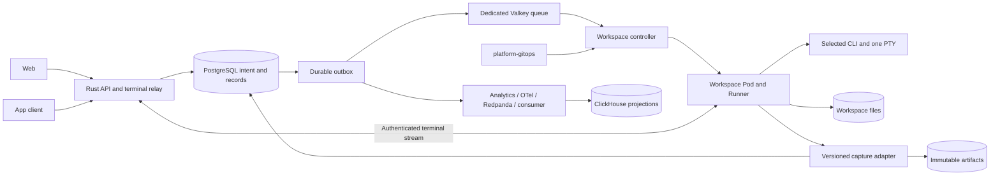

# Integrated Development Workspace

> SDD target design | [Requirements](../../../docs/llm/app-builder/requirements.md) | [Implementation status](../../../docs/llm/app-builder/implementation.md) | [Tasks](tasks.md)

## Scope and Status

| Item | Decision |
|------|----------|
| Product | Provider-independent remote development through web and app, with centralized prompts and organization-scoped work history |
| Current increment | One active Pod and one active PTY per workspace; multiple workspaces allocate independent Pods and checkouts |
| Existing baseline | Rust API-managed Pods, Runner, browser terminal, native capture, previews and Git routes exist; controller, central prompts, organization model and app client remain planned |
| SSOT | CDD holds constraints and implementation evidence; this spec owns target contracts; tasks link acceptance gates without duplicating architecture |
| Backend | Rust application use cases and ports; HTTP, Kubernetes, persistence and CLI implementations are adapters |
| Clients | Existing Next.js web; shared React components, generated API types and terminal protocol for app |
| App decision | Desktop Tauri is provisional; desktop/mobile/PWA choice remains open. A desktop shell consumes a static client, not an embedded Next.js SSR server |
| Deployment | All server deployment through platform-gitops; this repository supplies code, images and chart contracts |
| Deferred expansion | Multi-agent harness, automatic merge, physical-node autoscaling, new preview capabilities and custom model orchestration |
| Existing features | Preserve existing preview/Git behavior behind the flag; no removal implied by terminal-first sequencing |
| Release | Builder stays disabled by default until applicable qualification gates pass |

## Architecture and Ownership

| Owner | Responsibility |
|-------|----------------|
| platform-gitops | Deploy API/controller/relay, approved Runner images and profiles, namespace/RBAC/NetworkPolicy, PVC/NFS, secrets, TLS, quotas, backups and NodePools |
| API | Authenticate, authorize organization/project/workspace access; validate commands; persist operation intent and outbox in one transaction before acknowledging |
| Controller | Watch/reconcile durable desired state; create/adopt/stop runtime Pods within approved namespace, profiles and quotas |
| Runner | PTY lifecycle, process groups, checkpoints, capture, bounded output replay and explicit adapter capabilities |
| Runtime ownership | Dynamic Pods carry workspace/operation/generation labels; do not copy Argo tracking metadata or mutate Argo-managed Deployment replicas |
| Infrastructure boundary | No Git commit per terminal or Pod; node provisioning stays with infrastructure. Insufficient capacity yields queued/Pending status |
| GitOps qualification | Confirm actual catalog chart/image source before rollout; current app catalog references a separate runtime source. Preserve country-cluster and regional NodePool topology |
| Current gap | Existing handlers use direct Kubernetes HTTP calls, not kubectl subprocesses; migrate resource ownership to the controller |

## Domain and Data Contracts

| Entity | Identity and Minimum State |
|--------|----------------------------|
| Organization/project | Membership, roles, repository and policy scope; migrate current owner records into personal organization without widening access |
| Workspace | Stable typed UUIDv7 ID, project, checkout/PVC path, desired/observed state, resource profile, current runtime generation |
| Task | User objective, project/workspace, creator, status and acceptance criteria; independent of CLI vendor |
| Run | Task execution segment, actor, CLI adapter/version, native session, prompt submission, code/context references, outcome |
| CLI session | Native ID namespaced by adapter/account; capture capabilities, version, last consumed context revision and durable cursor |
| Runtime | Ephemeral Pod UID, workspace, generation, profile, readiness, heartbeat, termination/fencing evidence |
| Attachment | Authenticated client connection, replay cursor and observer/input-owner mode; disconnect does not end the run |
| Operation | Idempotency key scoped by organization/action, request hash, workspace generation, desired transition, result/error and retry state |
| Prompt | Project/organization scope, template metadata and immutable revisions; publication permissions separate from execution |
| Submission | Pinned revision or ad hoc prompt, rendered text, variables/context manifest, hashes, actor, run and delivery status |
| Event | Organization/project/workspace/task/run/session/runtime references, event ID, source sequence, schema version, occurred/received times, payload reference and capture status |
| Artifact/checkpoint | Immutable key/hash/size, code revision including dirty/untracked files, native backups, event cursor, completeness and integrity |

| Store | Authority and Limits |
|-------|----------------------|
| PostgreSQL | SSOT for identities, ownership, tasks/runs, prompt revisions/submissions, operation intent, structured event index, artifact references and outbox |
| NFS/RWX | Active checkout and workspace durable files; shared storage is not an authorization boundary |
| Object storage | Immutable terminal chunks, original native archives, attachments and checkpoint contents; publish verified references in PostgreSQL after upload |
| Valkey | Dedicated builder queue, leases, presence and bounded replay/notification buffers; recover queue from PostgreSQL intent after loss |
| ClickHouse | Derived history search, usage, latency, failures and cost analytics; never authoritative for access control or runtime state |
| Existing telemetry | Keep analytics -> OTel -> Redpanda -> consumer -> ClickHouse boundary; no direct Kafka/ClickHouse dependency in the core API |
| Durable analytics | Transactional outbox and retained source permit replay; existing fail-open telemetry alone does not satisfy work-history retention |
| Deduplication | Stable event IDs/source keys, idempotent consumers and deduplicated reads/aggregations; no end-to-end exactly-once claim |
| Cost | Record reported usage with source/capability; missing usage/cost is unknown rather than zero |

Additive `builder_*` migrations introduce organization/project bindings, tasks, runs, CLI sessions, operations, prompts/revisions/submissions, checkpoints/artifacts and outbox. Reuse existing repository/workspace/event tables where compatible; avoid parallel authorities. Migration scripts must upgrade existing databases, not only fresh-install SQL.

## Runtime and Storage Invariants

| Concern | Contract |
|---------|----------|
| Creation | Metadata creation allocates a persistent workspace; start creates an idempotent operation and durable enqueue intent |
| Queue | Separate `veronex:builder:queue:zset`; existing inference queue/scoring remains untouched |
| Reconcile | Deterministic operation/generation identity; adopt matching Pods after restart and reject duplicate live writers. Do not hold database transactions across Kubernetes requests |
| Input | One input owner per active PTY; web/app observers can attach concurrently; explicit transfer revokes the previous attachment's input rights |
| Disconnect | CLI continues independently of client sockets; replay output after cursor, never resend input automatically |
| Replacement | Stop or fence old Pod/node/storage writer before replacement; Valkey lease expiry cannot fence NFS writes |
| Unknown writer | Keep workspace blocked pending confirmed termination/fencing; do not trade file integrity for automatic restart |
| Files | `/orgs/<org-id>/projects/<project-id>/workspaces/<workspace-id>/{repo,native-archives,checkpoints,spool}`; stable `/workspace` path inside runtime |
| Isolation | Trusted provisioner prepares ownership; mount only workspace subtree. Enforce organization/PVC policy, non-root processes, no hostPath/Docker socket and no service-account token in work Pods |
| Native databases | Active SQLite/WAL uses local supported filesystem; consistent backups enter durable storage. Do not copy active database files without the consistency protocol |
| Reconnect | Preserve branch and dirty/untracked work; fetch/rebase is explicit, not automatic pull |
| Checkpoint | Quiesce writers, flush capture, upload/verify contents, then commit manifest and cursor; never restore partial manifests |
| Failure | Recover latest verified checkpoint plus valid later files/events; expose gaps and uncertain side effects; process memory and unflushed writes are not recoverable guarantees |
| Capacity | Provisional limit 2 active workspaces; configure bounded CPU/memory/storage/connection budgets after measurements; protect inference capacity |
| Suspend/archive | Checkpoint before normal stop; archive retains files/history. Deletion requires explicit retention policy and authorized action |
| Backup | NFS is a failure domain; separate backup target and restore drills required. Storage migration verifies hashes and ownership before switching PVC |

## Central Prompts and History

| Concern | Contract |
|---------|----------|
| Revision | Editing a template creates a new immutable revision; old submissions and runs retain their original revision |
| Submission snapshot | Persist actual rendered prompt, non-secret variables, context file/instruction versions, code revision and dirty/untracked snapshot references before dispatch |
| Credentials | Keep secret values outside prompts, handoffs and portable artifacts; store scoped secret references with restricted access |
| Delivery | Adapter must establish the CLI's supported ready/input state; do not paste prompts blindly into a shell |
| Delivery states | `recorded -> attempted -> confirmed`, or `failed/unknown`; PTY byte write is not proof of provider acceptance |
| Uncertain dispatch | After crash/reconnect, reconcile supported native evidence; never auto-resubmit unknown prompts |
| Capture channels | Platform submissions are definitive for platform input; versioned CLI hooks/native readers supply supported semantic records; terminal output supplies screen replay |
| Attribution | Distinguish human shell actions, platform dispatch and CLI tool actions; actor identity comes from server authentication, not client-supplied event metadata |
| Completeness | Direct terminal input/shell history cannot prove complete semantic command capture. Expose unsupported/partial/degraded capture and durable cursor |
| Privacy | Do not record raw input keystrokes/password entry; restrict terminal artifacts and redact known secrets. Output/native artifacts may contain sensitive content and need retention/access policy |
| Timeline | Append-only records with correction events; deduplicate source event ID or session/sequence. Cursor pagination and incremental capture replace fixed last-N scanning |
| Large records | Chunk bounded output to object storage; slow clients do not block CLI. Persist references only after verification and show spool/upload gaps |
| Access | Organization/project-scoped manage, execute, observe, prompt-publish and history-export permissions; enforce on API, WebSocket, artifacts and search |
| Audit | Record membership/permission changes, prompt publication, runtime lifecycle, exports and deletion without storing secret material |

## CLI Continuity and Future Harness

| Capability | Contract |
|------------|----------|
| Adapter | Launch, readiness, PTY, stop, capture, explicit native resume and handoff as independently reported capabilities; pin and qualify each supported CLI version |
| Same-CLI resume | Restore specific compatible native session ID and files; never select ambiguous latest session |
| Cross-CLI handoff | Quiesce old writer, checkpoint, prepare requirements/decisions/completed/pending work plus source evidence, then launch target session and record delivery |
| Return to prior session | Supply all intervening code/history since its consumed revision; preserve repository instruction files |
| Guarantees | Preserve captured evidence and durable files; native formats and hidden reasoning/model state are not interchangeable |
| Future harness | Consume the same task/run/submission/event/artifact contracts; no DAG scheduler or multi-agent execution engine in this increment |
| Existing previews/Git | Keep current behavior gated; preview isolation and remote side-effect reconciliation remain release requirements where those features are enabled |

## Proposed API and Client Surface

| Surface under `/v1/builder` | Behavior |
|-----------------------------|----------|
| `/projects`, `/repositories`, `/workspaces` | Scoped metadata, independent checkout and desired-state management |
| `/workspaces/{id}/operations` | Idempotent async start/suspend/archive/switch and outcome lookup |
| `/workspaces/{id}/terminal` | Authenticated WebSocket with cursor, resize and input ownership; ticket/origin/authorization checks |
| `/tasks`, `/tasks/{id}/runs` | Vendor-independent objective and execution ledger |
| `/prompts`, `/prompts/{id}/revisions` | Manage drafts, publish immutable versions and compare revisions |
| `/runs/{id}/submissions` | Save prompt snapshot, dispatch through adapter and inspect delivery state |
| `/workspaces/{id}/events` | Cursor history and durable event notifications; bounded replay with gap indication |
| `/artifacts`, `/history/exports` | Authorized artifact retrieval and auditable export jobs |
| Internal ingress | Authenticated, workspace/generation-scoped Runner reports and checkpoint ingestion |
| Client views | Workspace list, single terminal, prompt library/composer, task timeline, capture/delivery status and input ownership |

These are target contracts, not a claim that all routes exist. Reconcile current routes additively during P0; generate shared client types from the agreed contract.

## Acceptance Gates

| ID | Required Evidence |
|----|-------------------|
| A1 | Disabled builder creates no runtime resources or Kubernetes startup dependency; existing inference/auth/provider/queue/UI tests pass |
| A2 | Duplicate starts and controller restart yield one active writer; Valkey loss reconstructs queued work from PostgreSQL |
| A3 | App/web reconnect to same PTY; ownership transfer rejects old owner input; no input replay |
| A4 | Pod replacement restores dirty/untracked source and qualified native session; partitioned old writer prevents unsafe replacement |
| A5 | Prompt revision changes cannot alter previous run snapshots; failed/unknown dispatch never silently resends |
| A6 | Capture exceeds previous last-N limits without silent loss; disconnect/retry deduplicates events and exposes durable cursor/gaps |
| A7 | PostgreSQL/object store/analytics outage exercises spool limits, acknowledgement boundaries and replay; ClickHouse totals remain deduplicated |
| A8 | Cross-organization API/socket/artifact/search access denied; role revocation affects active attachment; export and deletion audited |
| A9 | Pinned real CLIs pass capture/resume/handoff checks independently; fixtures do not qualify vendor-authenticated behavior |
| A10 | GitOps reconciliation/prune leaves properly owned runtime Pods intact; controller only manages authorized namespace/profile resources |
| A11 | Resource stress stays within agreed inference latency/throughput budget; quota exhaustion surfaces queued/Pending status |
| A12 | Disable/drain/rollback preserves history and additive schema; backup/PVC restore verifies hashes and stable identity |
| A13 | Preserved preview/Git routes pass existing regressions; enabled previews cannot read CLI credentials/native archives; retries reconcile remote side effects |

## Open Decisions and References

| Decision | Before |
|----------|--------|
| App form and supported operating systems | P0 client packaging; Tauri remains a proposal |
| CLI versions and legitimate login flow | Runtime qualification; isolate person/organization credential scopes |
| Storage class, object store, retention and deletion policy | Durable history release |
| Capacity and inference regression budget | Cluster enablement after measured baseline |
| GitOps chart/image catalog mapping | Deployment change in platform-gitops |
| Preview origin/TLS and merge policy | Enabling retained preview/merge capabilities |

| Source | Constraint |
|--------|------------|
| [Kubernetes controllers](https://kubernetes.io/docs/concepts/architecture/controller/) | Reconciliation ownership |
| [Persistent volumes](https://kubernetes.io/docs/concepts/storage/persistent-volumes/) | Storage lifecycle and access modes |
| [Argo resource tracking](https://argo-cd.readthedocs.io/en/stable/user-guide/resource_tracking/) | GitOps/runtime tracking separation |
| [SQLite WAL](https://www.sqlite.org/wal.html) | Local active database and consistent backups |
| [ClickHouse deduplication](https://clickhouse.com/docs/concepts/features/operations/insert/deduplication) | Retry deduplication limits |
| [CLI hooks](https://code.claude.com/docs/en/hooks) | Versioned supported capture surface |
| [Codex CLI](https://learn.chatgpt.com/docs/codex/cli) | Native session resume |
| [Tauri with Next.js](https://v2.tauri.app/start/frontend/nextjs/) | Static client packaging |
| [Repository architecture](../../../.ai/architecture.md) | Hexagonal boundaries |
| [ID policy](../../../docs/llm/policies/id-encoding.md) | Typed UUIDv7 identifiers |
