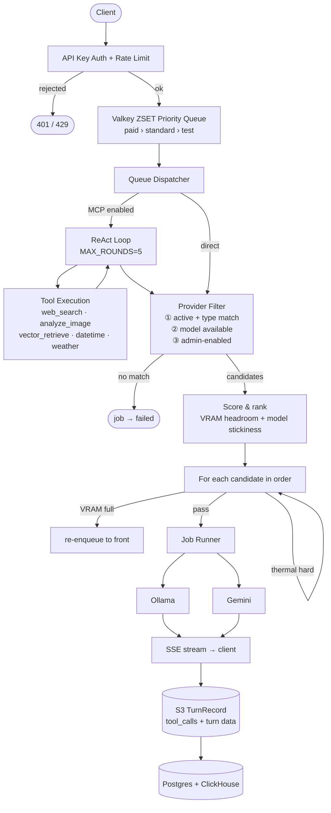
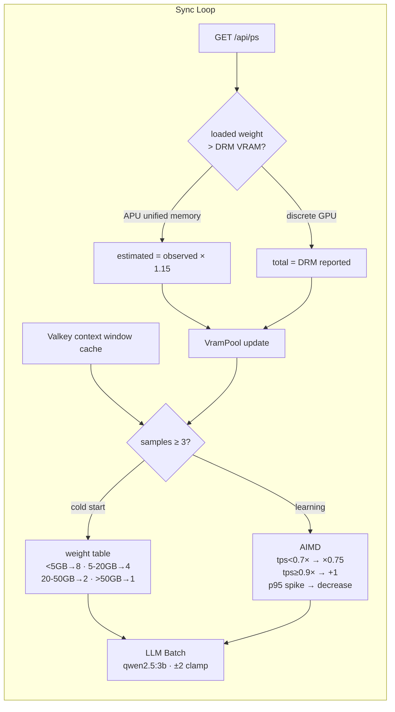

# Veronex

**Autonomous scheduler and gateway for N Ollama servers** — VRAM-aware routing, adaptive concurrency, thermal protection, MCP agentic loop, OpenAI-compatible API.

Veronex treats all your Ollama instances as a single compute pool. It learns optimal concurrency per model through live inference data, runs ReAct-style tool-calling loops via MCP, and compresses long conversations automatically.

- **Smart routing** — dispatches to the provider with the most VRAM headroom; keeps models resident to avoid reloading
- **Adaptive concurrency** — learns `max_concurrent` per model via AIMD (TPS + p95), refined via LLM batch analysis
- **Thermal protection** — detects GPU/CPU thermal state per provider; throttles automatically before hardware is stressed
- **MCP agentic loop** — ReAct loop with multi-round tool calling (web search, image analysis, vector retrieval, datetime, weather)
- **Context compression** — automatic conversation summarization when approaching context window limits
- **Self-healing queue** — lease-based ZSET with heartbeat reaper; orphaned jobs are automatically recovered or failed
- **API compatible** — OpenAI, Ollama native, and Gemini — drop-in for existing clients and SDKs

---

## Quick Start

```bash
git clone <repo> && cd veronex
cp .env.example .env          # set JWT_SECRET (required)
docker compose up -d
open http://localhost:3002     # setup wizard → create admin → add provider → get API key
```

> **macOS**: `OLLAMA_URL=http://host.docker.internal:11434` works out of the box.
> **Linux**: set `OLLAMA_URL=http://172.17.0.1:11434` in `.env`.

```bash
curl http://localhost:3001/v1/chat/completions \
  -H "Authorization: Bearer iq_..." \
  -H "Content-Type: application/json" \
  -d '{"model": "llama3.2", "messages": [{"role": "user", "content": "Hello"}], "stream": true}'
```

```python
from openai import OpenAI
client = OpenAI(base_url="http://localhost:3001/v1", api_key="iq_...")
client.chat.completions.create(model="llama3.2", messages=[...])
```

Interactive API docs: `http://localhost:3001/swagger-ui`

---

## How It Works

### Request Flow



### Adaptive Concurrency (per provider × model, every 30s)



### Lease-Based Queue

Workers hold a lease on `queue:active` (ZSET, score = deadline_ms) and renew every 30s. If a worker dies mid-job, the reaper reclaims the expired lease and re-enqueues up to 2 times before marking the job permanently failed.

---

## Services

| Service | Port | Role |
|---------|------|------|
| veronex | 3001 | API server (OpenAI compat + admin) |
| veronex-web | 3002 | Dashboard UI |
| veronex-agent | — | Provider sync, metrics, KEDA autoscaling |
| veronex-embed | — | Embedding service (multilingual-e5-large, 1024-dim) |
| veronex-mcp | — | MCP server (tools: web_search, weather, datetime, vector) |
| veronex-analytics | — | Analytics ingest |
| PostgreSQL | 5433 | Primary store |
| Valkey | 6380 | Queue, cache, pub/sub |
| ClickHouse | 8123 | Analytics |
| Redpanda | — | Kafka-compatible event stream |
| OTel Collector | 4317/4318 | Telemetry ingestion |

---

## Tech Stack

| | |
|-|-|
| **API server** | Rust · Axum 0.8 · tokio · SSE |
| **Scheduler** | Valkey (Lua ZSET priority queue + lease ZSET) · PostgreSQL 18 |
| **MCP / Embedding** | Rust + fastembed · multilingual-e5-large · SearXNG |
| **Analytics** | ClickHouse · OTel Collector · Redpanda |
| **Dashboard** | Next.js 16 · React 19 · Tailwind v4 · shadcn/ui |
| **Deploy** | Docker Compose · Kubernetes (Helm + KEDA) |

---

## License

MIT
