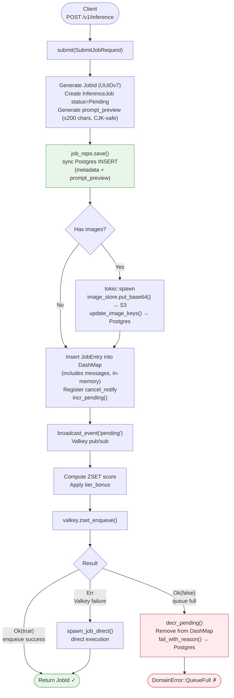
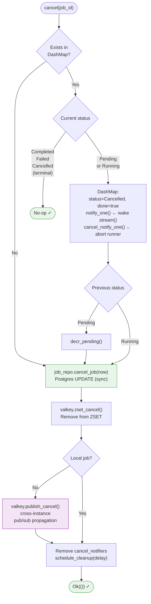
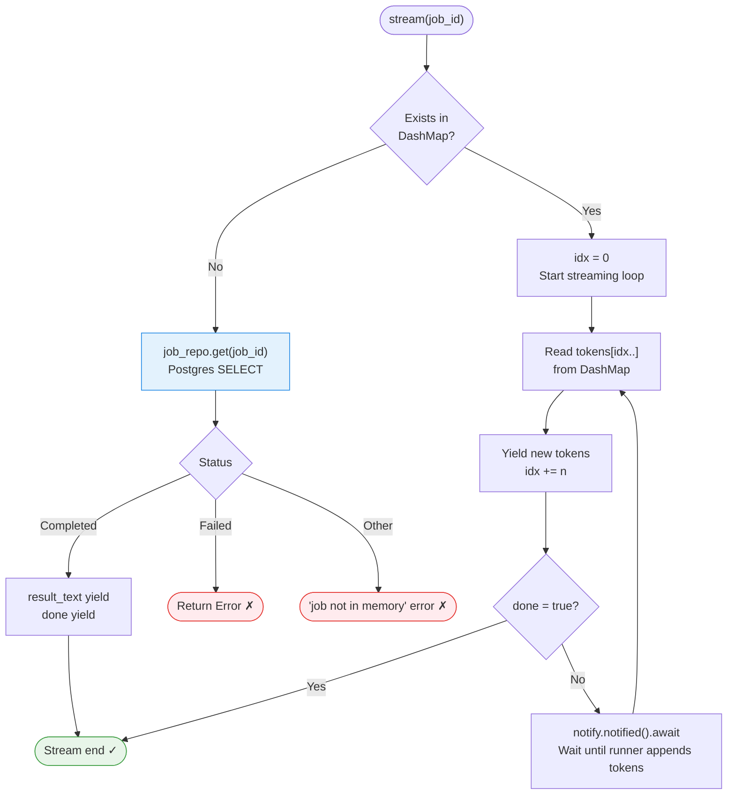
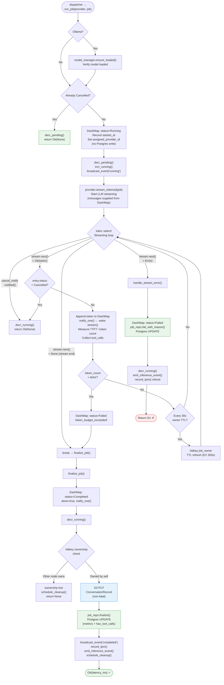

# Job Write Pipeline — Step Diagrams

> **Last Updated**: 2026-03-28
> Overview, State Transitions, Repo Call Mapping: `flows/job-event-pipeline.md`

---

## ① submit() — Request Submission

---

## ② cancel() — Cancellation

---

## ③ stream() — Token Streaming

---

## ④ run_job() — Inference Execution

