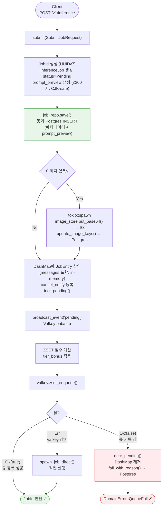
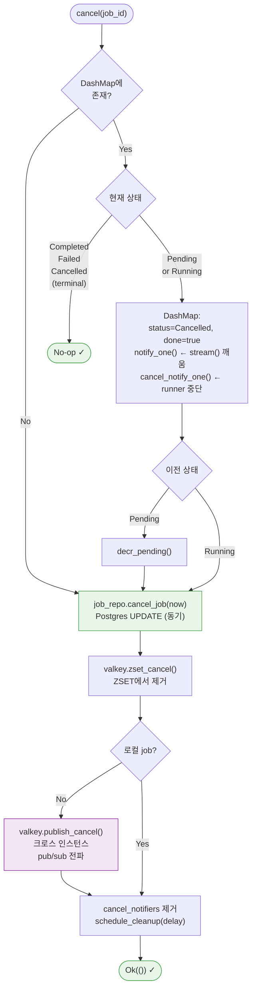
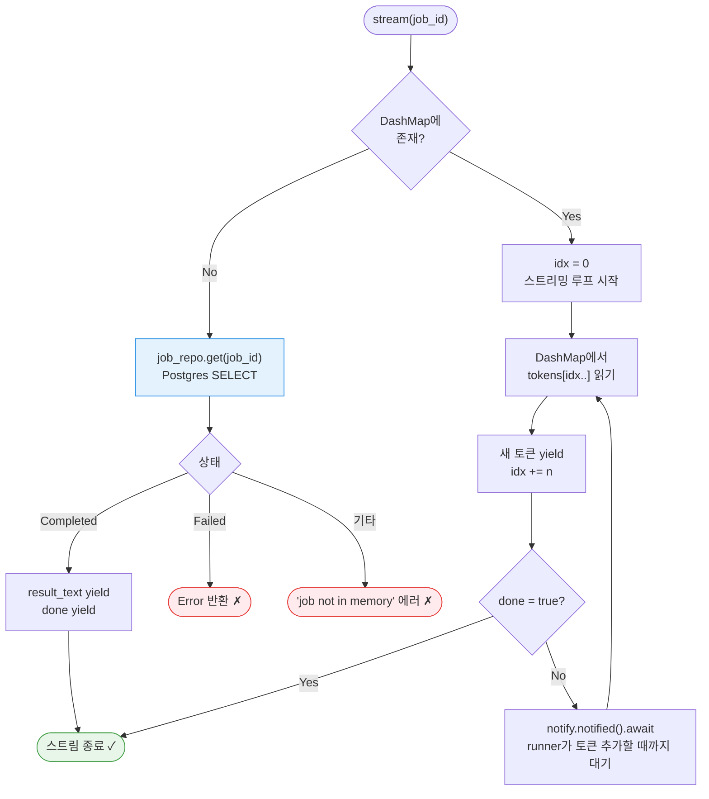
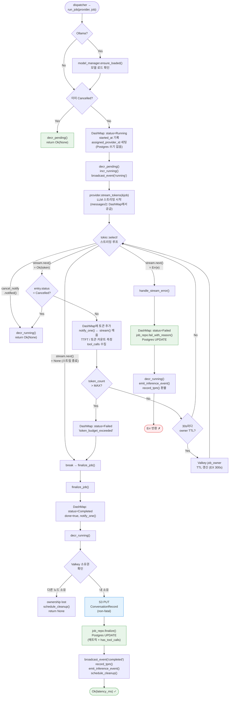
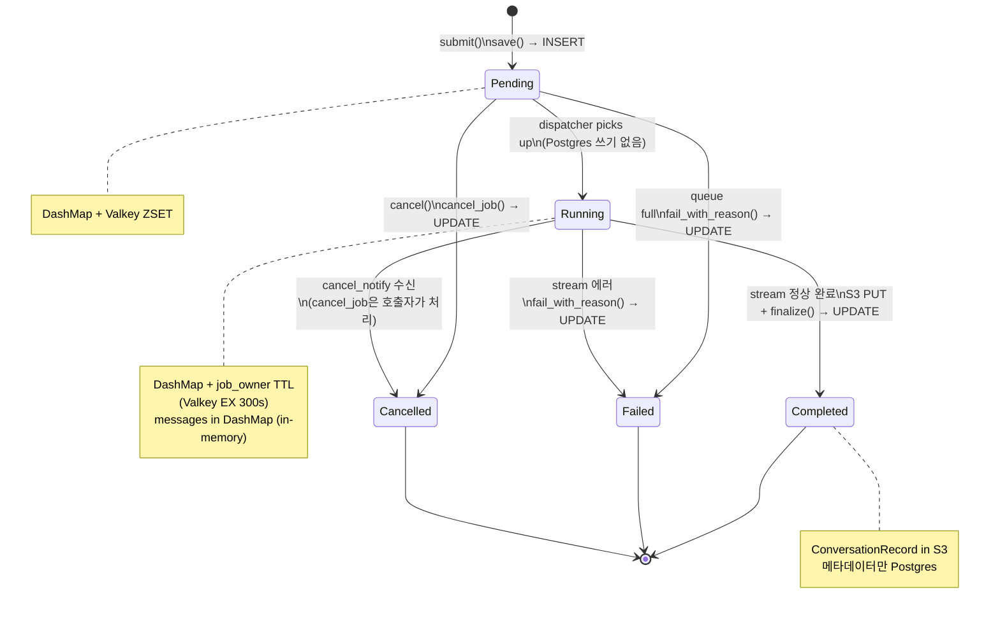
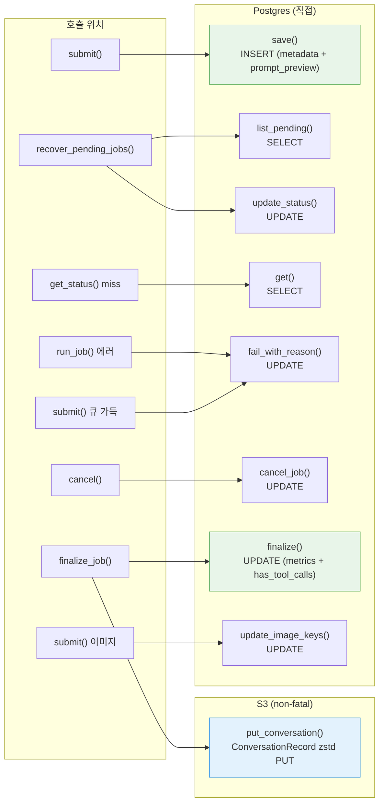

# Job Write Pipeline — 전체 플로우

> **Last Updated**: 2026-03-26

---

## 전체 아키텍처

---

## ① submit() — 요청 제출

---

## ② cancel() — 취소

---

## ③ stream() — 토큰 스트리밍

---

## ④ run_job() — 실제 추론 실행

---

## ⑤ 상태 전이

---

## ⑥ JobRepository 호출 매핑

