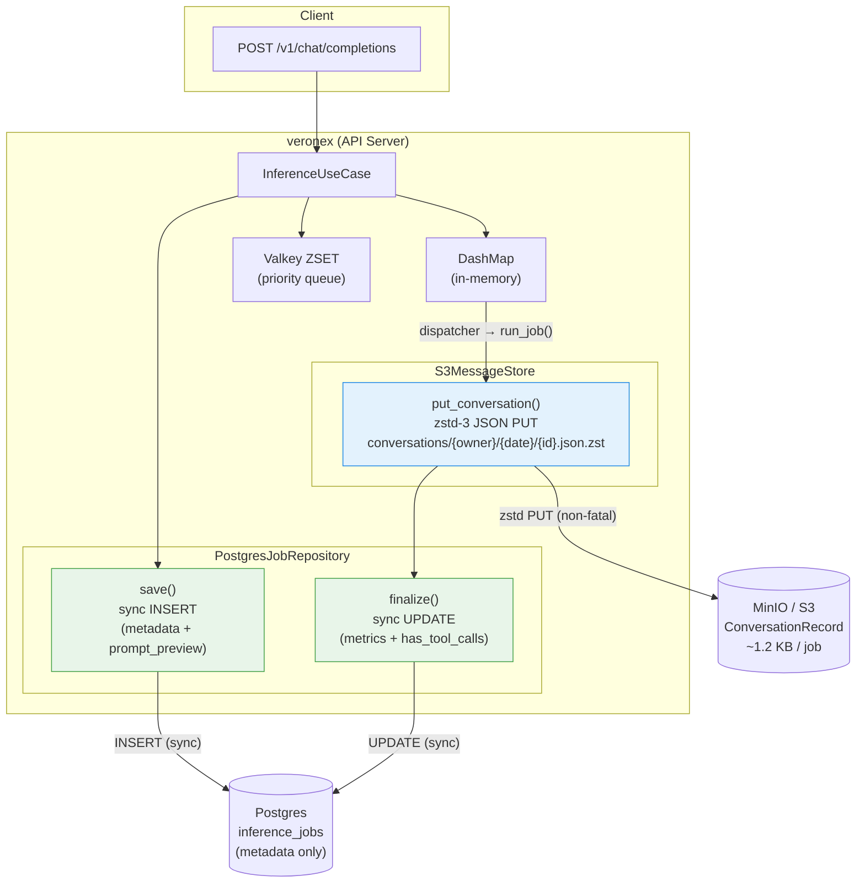
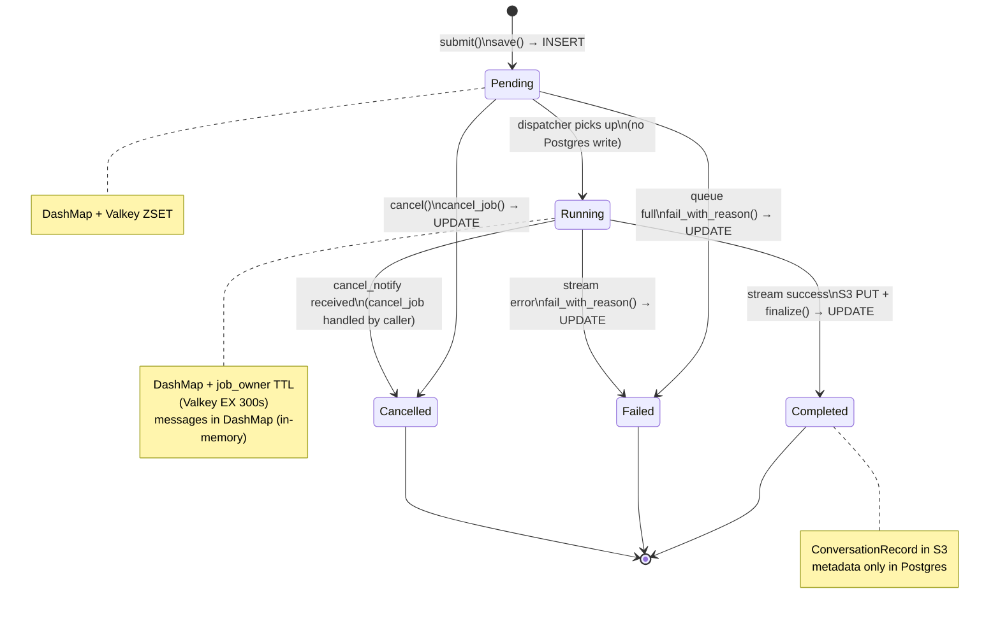
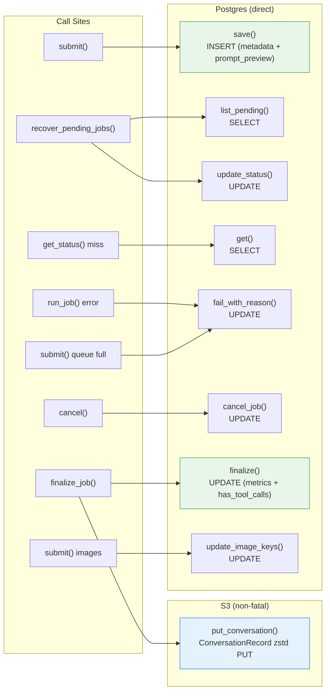

# Job Write Pipeline — Full Flow

> **Last Updated**: 2026-03-28
> Step diagrams (submit/cancel/stream/run_job): `flows/job-event-pipeline-steps.md`

---

## Overall Architecture

---

## ⑤ State Transitions

---

## ⑥ JobRepository Call Mapping

