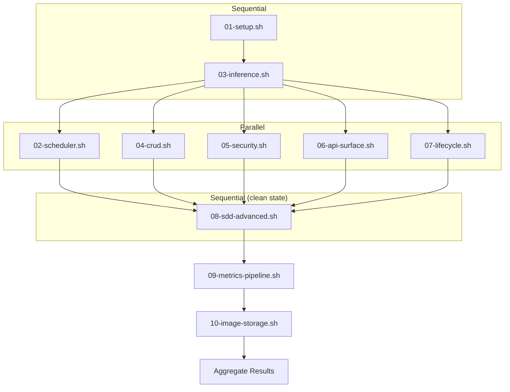
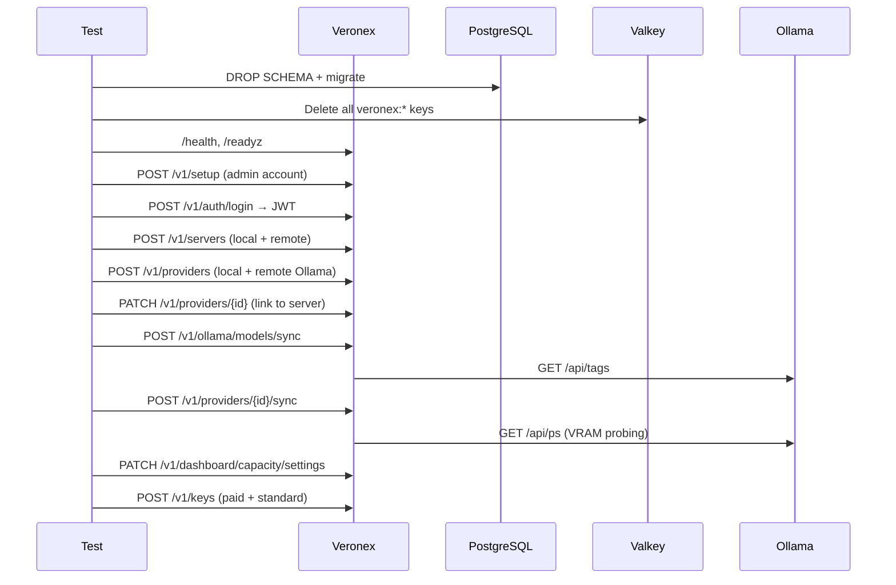
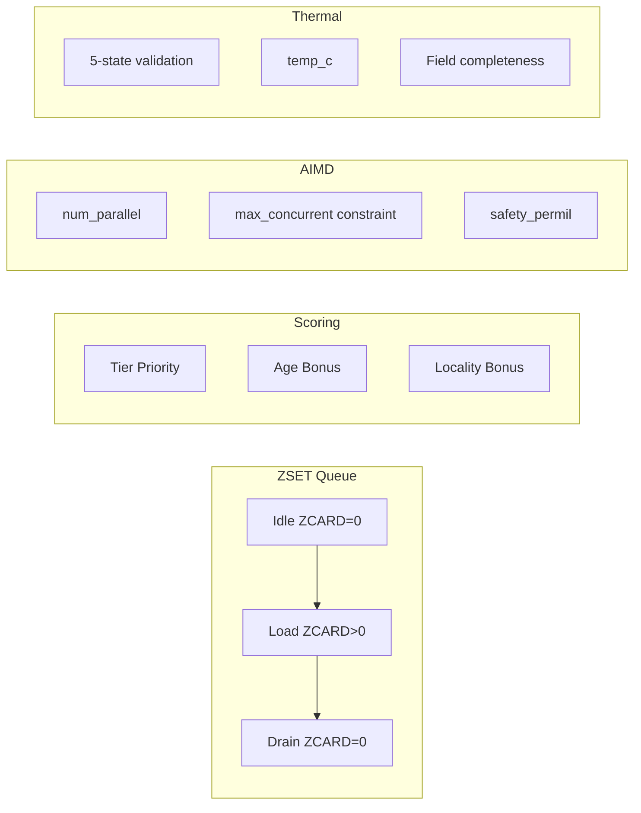
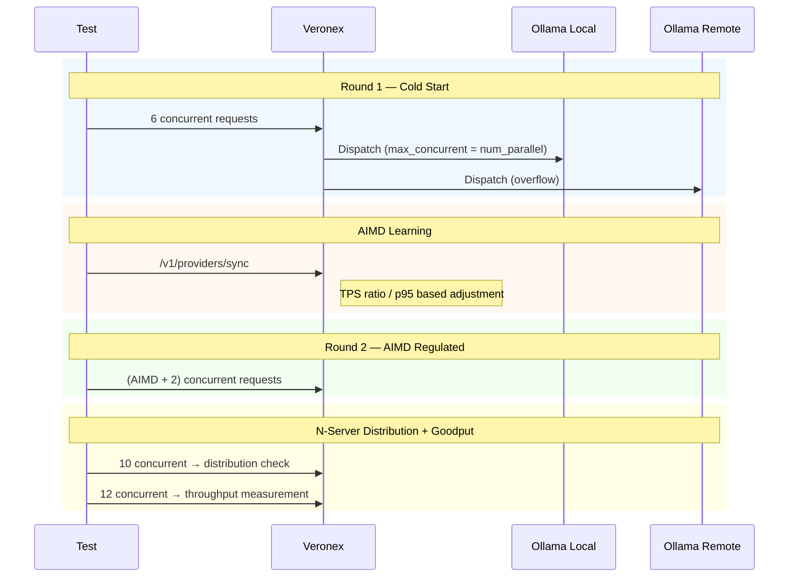
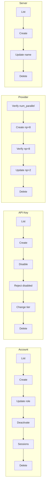
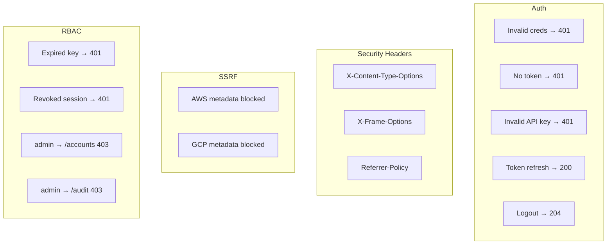
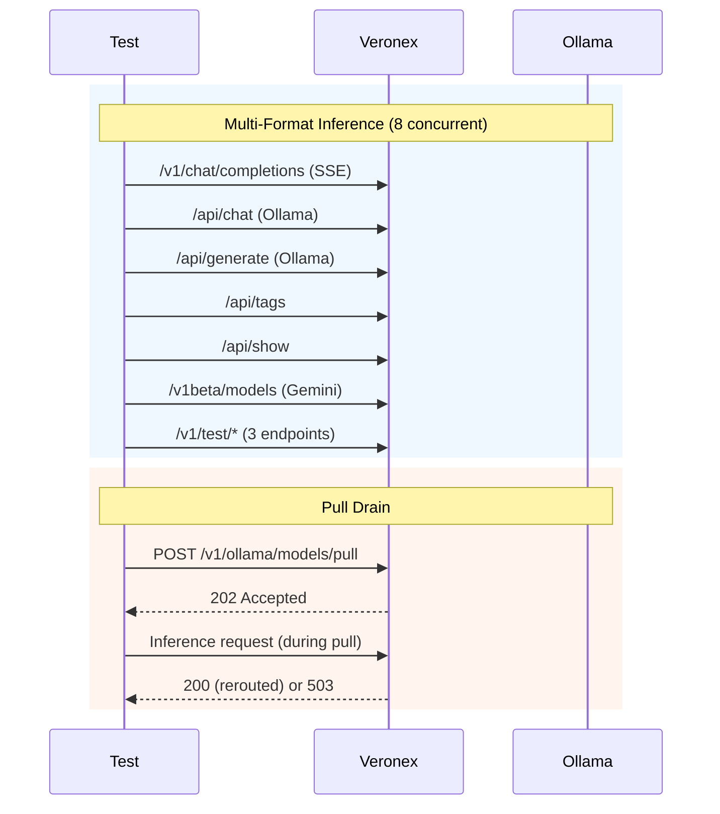
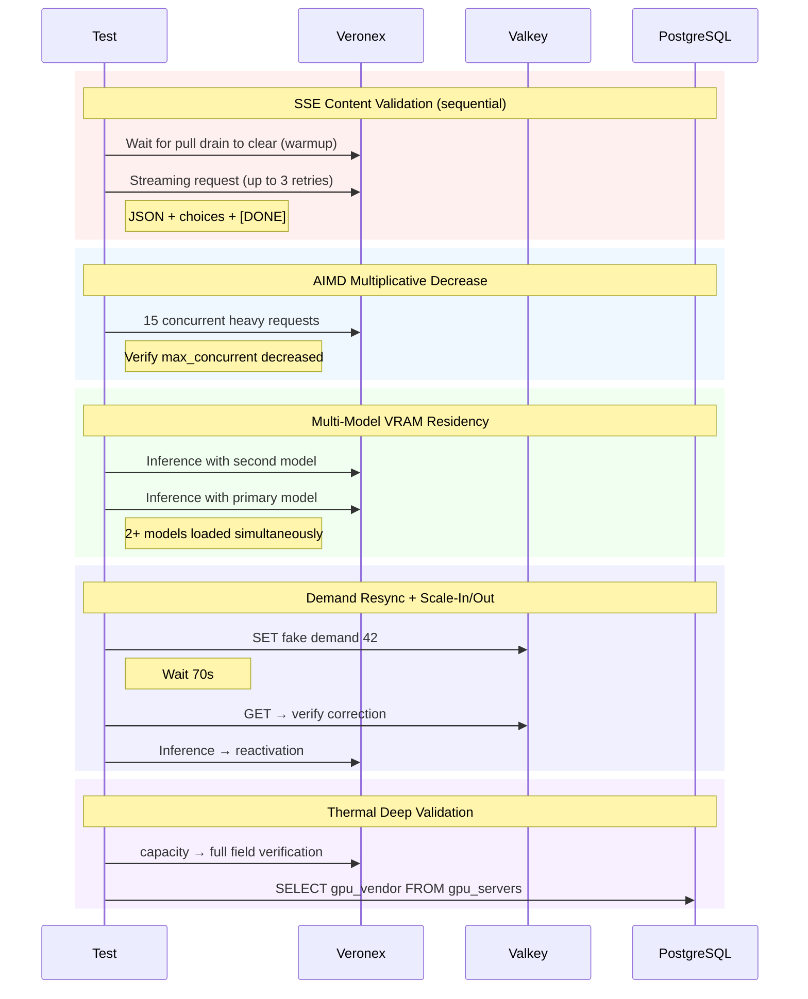

# Veronex E2E Test Suite

> **Last Updated**: 2026-03-15

---

## How to Run

```bash
./scripts/test-e2e.sh

# Override environment variables
MODEL=qwen3:8b CONCURRENT=8 ./scripts/test-e2e.sh
SKIP_DB_RESET=1 ./scripts/test-e2e.sh
```

**Prerequisites**: `docker compose up` (Veronex stack running), at least one reachable Ollama provider

---

## Execution Flow



---

## 01-setup.sh — Infrastructure Bootstrap

Resets DB, authenticates, registers dual providers, creates API keys. Establishes the full initial state for all subsequent phases.



| Test | Validates |
|------|-----------|
| DB reset + Valkey clear | Schema reset, veronex:* keys deleted, container restart |
| health / readyz | Health check endpoints respond correctly |
| Admin account creation | POST /v1/setup → 200/201 |
| JWT token issuance | POST /v1/auth/login → extract access_token from cookie |
| Local server registration | POST /v1/servers → returns id |
| Local provider registration | POST /v1/providers (num_parallel=4) → returns id |
| Remote server/provider | Same flow for second set |
| Provider-server link | PATCH /v1/providers/{id} (server_id, gpu_index) |
| Dual provider verification | GET /v1/providers → count >= 2 |
| Global model sync | POST /v1/ollama/models/sync → wait for completion |
| Per-provider sync | POST /v1/providers/{id}/sync → VRAM probing |
| Model availability | GET /v1/ollama/models → MODEL present |
| Capacity settings | PATCH + GET /v1/dashboard/capacity/settings |
| Paid API key | POST /v1/keys (tier=paid) |
| Standard API key | POST /v1/keys (tier=free) |

---

## 02-scheduler.sh — Core Scheduler Validation

Validates AIMD, ZSET queue, thermal state, scoring, demand counters, and gateway intelligence.



| Test | Validates |
|------|-----------|
| Capacity dual-provider | Both providers appear in capacity response |
| Thermal 5-state | All provider states in {normal,soft,hard,cooldown,rampup} |
| temp_c present | Node-exporter temperature flows to capacity API |
| num_parallel field | All providers have num_parallel set (AIMD upper bound) |
| max_concurrent <= num_parallel | Per-model max_concurrent does not exceed num_parallel |
| ZSET idle state | veronex:queue:zset ZCARD=0, enqueue_at side hash empty |
| ZSET load + drain | 4 requests → ZCARD increases → ZCARD=0 after completion |
| Tier priority | paid_score < standard_score → paid served first |
| Age bonus ordering | First-enqueued score <= second-enqueued (FIFO) |
| Locality bonus | Loaded model gets 20,000ms score offset |
| Thermal structure fields | provider_id, thermal_state, loaded_models, etc. present |
| Preload NX lock | veronex:preloading:* key pattern exists in Valkey |
| Scale-Out trigger | 8-request burst → demand > eligible_capacity x 0.80 → 2 providers loaded |
| safety_permil range | provider_vram_budget rows exist, permil in [1..1000] |
| committed_parallel guard | Per-provider sum(max_concurrent) verified |
| AIMD Cold Start | max_concurrent <= num_parallel (DB query) |
| Demand counter lifecycle | INCR on enqueue → DECR on dispatch → 0 after drain |
| Provider sync | POST /v1/providers/{id}/sync → 200/202 |
| All-providers sync | POST /v1/providers/sync → 200/202/409 |
| Dashboard overview | total_jobs, queue_depth, capacity_providers verified |

---

## 03-inference.sh — Inference Burst + AIMD Learning

Validates the full inference lifecycle from Cold Start through AIMD learning to regulated load.



| Test | Validates |
|------|-----------|
| Round 1 Cold Start | 6 concurrent requests → OK >= 1 |
| Jobs recorded | /v1/dashboard/jobs → count >= 1 |
| AIMD learned value | max_concurrent > 0 in capacity response |
| AIMD constraint | max_concurrent <= num_parallel |
| model_vram_profiles DB | weight_mb, kv_per_request_mb, baseline_tps persisted |
| inference_jobs DB | Status counts verified |
| num_parallel column | Column exists in llm_providers table |
| Round 2 AIMD regulated | AIMD_LIMIT + 2 requests → all completed, 0 failures |
| Usage data | /v1/usage?hours=1 → total_requests recorded |
| Usage breakdown | /v1/usage/breakdown?hours=1 → 200 |
| Performance metrics | /v1/dashboard/performance?hours=1 → 200 |
| ZSET drained | ZCARD=0 after rounds |
| N-server distribution | 10 concurrent → DB GROUP BY provider → 2 providers processed |
| AIMD convergence | max_concurrent converges below num_parallel |
| Lazy Eviction residency | Model stays loaded after requests (180s idle before eviction) |
| Goodput measurement | 12 concurrent → completed / elapsed = req/s |

---

## 04-crud.sh — Account / Key / Provider / Server CRUD

Validates the full create-read-update-delete lifecycle for all resources.



| Test | Validates |
|------|-----------|
| List accounts | GET /v1/accounts → 200 |
| Create account | POST /v1/accounts → 200/201 + id returned |
| Update role | PATCH /v1/accounts/{id} → 204 |
| Deactivate | PATCH /v1/accounts/{id}/active → 204 |
| List sessions | GET /v1/accounts/{id}/sessions → 200 |
| Delete account | DELETE /v1/accounts/{id} → 204 |
| Duplicate username | POST same username → 400/409/500 |
| List keys | GET /v1/keys → 200 |
| Create key | POST /v1/keys → 200/201 |
| Disable key | PATCH /v1/keys/{id} is_active=false → 204 |
| Reject disabled key | Inference with disabled key → 401/403 |
| Change tier | PATCH /v1/keys/{id} tier=paid → 204 |
| Delete key | DELETE /v1/keys/{id} → 204 |
| Provider num_parallel | Verify num_parallel field on existing provider |
| Create provider np=8 | POST /v1/providers num_parallel=8 → 201 |
| Verify np=8 stored | GET /v1/providers → num_parallel=8 |
| Update num_parallel | PATCH /v1/providers/{id} num_parallel=2 → 200 |
| Delete provider | DELETE /v1/providers/{id} → 204 |
| Non-existent provider | GET /v1/providers/000.../models → 404 |
| Provider models | GET /v1/providers/{id}/models → 200 |
| Selected models | GET /v1/providers/{id}/selected-models → 200 |
| Model disable/enable | PATCH selected-models/{model} is_enabled=false/true |
| Model-to-provider mapping | GET /v1/ollama/models/{model}/providers → 200 |
| List servers | GET /v1/servers → 200 |
| Create server | POST /v1/servers → 201 |
| Update server name | PATCH /v1/servers/{id} → 200 |
| Delete server | DELETE /v1/servers/{id} → 204 |

---

## 05-security.sh — Auth / Security / Rate Limit / RBAC

Validates auth edge cases, security headers, SSRF defense, rate limiting, and role-based access control.



| Test | Validates |
|------|-----------|
| Invalid credentials | POST /v1/auth/login wrong password → 401 |
| No token access | GET /v1/providers without token → 401 |
| Invalid API key | Bearer sk-invalid-key → 401 |
| Token refresh | POST /v1/auth/refresh → 200 |
| Logout | POST /v1/auth/logout → 204 |
| X-Content-Type-Options | /health response header contains nosniff |
| X-Frame-Options | Contains DENY |
| Referrer-Policy | Header present |
| SSRF: AWS metadata | 169.254.169.254 URL registration blocked |
| SSRF: GCP metadata | metadata.google.internal URL registration blocked |
| Oversized model name | 300-char model name → 400/413/422 |
| RPM rate limit | rate_limit_rpm=2 key with 3 requests → 429 |
| Expired key rejection | expires_at in past → 401 |
| Session revocation | DELETE /v1/sessions/{id} → subsequent request 401 |
| RBAC admin → accounts | Admin role accessing /v1/accounts → 403 |
| RBAC admin → audit | Admin role accessing /v1/audit → 403 |
| MAX_QUEUE constants | MAX_QUEUE_PER_MODEL=2000, MAX_QUEUE_SIZE=10000 (info) |

---

## 06-api-surface.sh — Multi-Format Inference + Endpoints + Pull Drain

Validates all inference formats (OpenAI/Ollama/Gemini), full endpoint smoke tests, and Pull Drain.



| Test | Validates |
|------|-----------|
| OpenAI SSE streaming | /v1/chat/completions stream=true → data: events present |
| Ollama /api/chat | 200 |
| Ollama /api/generate | 200 |
| Ollama /api/tags | 200 |
| Ollama /api/show | 200 |
| Gemini /v1beta/models | 200 |
| Test completions | /v1/test/completions → 200 |
| Test chat | /v1/test/api/chat → 200 |
| Test generate | /v1/test/api/generate → 200 |
| SSE JSON structure | data: lines contain valid JSON with choices field |
| SSE [DONE] | Stream ends with [DONE] marker |
| /v1/servers | 200 |
| /v1/audit | 200 |
| /v1/dashboard/lab | 200 |
| /v1/dashboard/analytics | 200 |
| /v1/dashboard/queue/depth | 200 |
| /v1/dashboard/overview | 200 |
| OpenAPI spec | /docs/openapi.json → 200 |
| Swagger UI | /docs/swagger → 200 |
| Redoc UI | /docs/redoc → 200 |
| /v1/metrics/targets | 200 |
| /api/version | 200 |
| /api/ps | 200 |
| /api/embed | 200 or 501 (not supported) |
| /api/embeddings | 200 or 500 (not supported) |
| Local server metrics | /v1/servers/{id}/metrics → 200 |
| Local metrics history | /v1/servers/{id}/metrics/history → 200 |
| Remote server metrics | 200 |
| Provider key | /v1/providers/{id}/key → 200 or 404 |
| Session grouping | POST /v1/dashboard/session-grouping/trigger → 200/202 |
| Lab toggle + revert | PATCH /v1/dashboard/lab gemini_function_calling toggle and restore |
| Per-key usage | /v1/usage/{key_id}?hours=24 → 200 |
| Per-key jobs | /v1/usage/{key_id}/jobs → 200 |
| Per-key models | /v1/usage/{key_id}/models → 200 |
| Job detail | /v1/dashboard/jobs/{id} → 200 |
| Pull drain endpoint | POST /v1/ollama/models/pull → 202/200/409 |
| Pull dispatch block | During pull, inference reroutes to non-pulling provider (200) or 503 |

---

## 07-lifecycle.sh — Cancel / SSE / Password Reset / Edge Cases / Crash Recovery

Validates job lifecycle, cancellation contract, SSE replay, password reset, edge cases, and crash recovery.

```mermaid
flowchart TD
    subgraph "Processing Cancel"
        PC1[Start streaming] --> PC2[Find running job after 3s] --> PC3[DELETE] --> PC4[status=cancelled]
    end

    subgraph "Queued Cancel"
        QC1[Fire 30 requests] --> QC2[Immediately poll] --> QC3[Check ZSET] --> QC4[DELETE] --> QC5[ZSET removal] --> QC6[Demand check]
    end

    subgraph "Crash Recovery"
        CR1[Submit job] --> CR2[Restart veronex] --> CR3[Verify job state preserved] --> CR4[No zombie jobs]
    end
```



| Test | Validates |
|------|-----------|
| Cancel during streaming | 300-token stream → DELETE after 3s → status=cancelled |
| Post-cancel recovery | Warmup request after cancel → 200 (up to 20 retries) |
| Native inference API | POST /v1/inference → job_id |
| Job status query | GET /v1/inference/{id}/status → 200 |
| Job stream query | GET /v1/inference/{id}/stream → 200 |
| Job cancel | DELETE /v1/inference/{id} → 200/204 |
| SSE replay | GET /v1/jobs/{id}/stream → accessible |
| Dashboard SSE | GET /v1/dashboard/jobs/stream → 200 |
| Password reset link | POST /v1/accounts/{id}/reset-link → 200 |
| Password reset | POST /v1/auth/reset-password → 204 |
| Login with new password | POST /v1/auth/login with new password → 200 |
| Token reuse rejected | Same reset token reused → 400/401/404/410 |
| Queued cancel | 30 saturating requests → find queued job → DELETE → ZSET removal |
| Demand counter consistency | Demand after cancel <= demand before cancel |
| Model disable routing | Local model off → routes to remote or 503 |
| Model enable restore | Local model re-enabled |
| Job filter: status | ?status=completed → 200 |
| Job filter: search | ?q=hello → 200 |
| Job filter: source | ?source=api → 200 |
| Session revoke | DELETE /v1/sessions/{id} → 200/204 |
| Dashboard total_jobs | /v1/dashboard/stats → total_jobs > 0 |
| Crash recovery: job preserved | After veronex restart, job state retained (completed/failed/queued) |
| Crash recovery: no zombies | No zombie jobs in processing list after restart |

---

## 08-sdd-advanced.sh — AIMD Decrease / Multi-Model / Scale-In/Out / Thermal Deep

Validates advanced scheduler mechanisms under clean state after parallel phases complete.



| Test | Validates |
|------|-----------|
| SSE content | Valid JSON with choices field (up to 3 retries) |
| SSE [DONE] | Stream termination marker |
| AIMD decrease (stress) | 15 concurrent max_tokens=300 → max_concurrent decreased or stable |
| System survival | 15/15 completed |
| AIMD DB persistence | model_vram_profiles rows exist |
| Multi-model inference | Second model inference → 200 |
| Multi-model residency | 2+ models loaded simultaneously in capacity |
| VRAM accounting | weight_sum, used_vram, model_count verified |
| Demand resync setup | Fake model demand set to 42 in Valkey |
| Scale-In detection | 70s wait → Scale-In events in logs or idle state |
| Demand resync verification | Fake demand corrected to 0 or deleted |
| Scale-Out reactivation | Inference after idle → 200 |
| Thermal field completeness | All required fields per provider + per model, valid types |
| gpu_vendor query | servers.gpu_vendor check (SKIP: agent not deployed) |
| gpu_vendor mapping | Vendor → thermal profile mapping (SKIP: agent not deployed) |
| perf_factor | All normal → perf_factor=1.0 |
| VRAM safety margin | used <= total, available >= 0 for all providers |

---

## 09-metrics-pipeline.sh — Metrics Pipeline End-to-End

Validates the full metrics data path: agent scrape → OTLP push → OTel Collector → Redpanda → ClickHouse → analytics API. Tests both gauge metrics (memory, GPU temp/power) and counter-derived metrics (CPU usage %).

| Test | Validates |
|------|-----------|
| Agent scrape | Agent scrapes node-exporter metrics (server type targets) |
| OTLP push | Metrics pushed to OTel Collector via OTLP HTTP |
| Redpanda topic | otel-metrics topic contains gauge and sum data points |
| ClickHouse MV | kafka_otel_metrics_mv processes both gauge and sum types |
| otel_metrics_gauge populated | Rows present for memory, CPU, GPU metrics |
| Analytics history API | GET /v1/servers/{id}/metrics/history returns ServerMetricsPoint |
| CPU usage % | cpu_usage_pct field present (counter delta computation) |
| GPU temp/power | gpu_temp_c, gpu_power_w fields present (requires node_hwmon_chip_names in allowlist) |
| Local server (Mac) | Metrics collected from local dev machine |
| Remote server (Ubuntu) | Metrics collected from remote Ryzen AI 395+ server |

---

## 10-image-storage.sh — Image Storage & Provider Name

Validates image inference through both API key and test panel paths, S3 WebP storage, thumbnail access, and provider_name field population.

| Test | Validates |
|------|-----------|
| Vision model detection | Local Ollama has a vision model (llava, minicpm-v, etc.) |
| API image inference | /api/generate with base64 image → 200, response contains text |
| Test panel image inference | /v1/test/completions with images array → 200 |
| S3 WebP storage | Job image stored as WebP in S3 bucket |
| Thumbnail access | Thumbnail URL returns image data |
| provider_name field | Job response includes provider_name (non-empty) |

---

## Skipped Tests

### gpu_vendor Thermal Mapping

`gpu_vendor` is populated by **veronex-agent** (`hw_metrics.rs`), a separate binary that scrapes hardware info on each Ollama server. The agent is not deployed in E2E, so `servers.gpu_vendor` remains NULL and threshold mapping cannot be verified.

The logic is fully implemented in `thermal.rs`. To enable: deploy the agent or manually seed the DB.

### Not Feasible in E2E

| Category | Feature | Reason |
|----------|---------|--------|
| Temperature | Soft/Hard/Cooldown/RampUp behavior | Cannot induce 82C+ in CI |
| Temperature | Hard Gate 60s forced drain | Requires 90C+ |
| Long wait | promote_overdue | Requires 250s+ queue wait |
| Long wait | max_queue_wait timeout | Requires 300s wait |
| Extreme load | MAX_QUEUE_SIZE 10k | Requires 10,000 concurrent enqueues |
| Extreme load | OOM (safety_permil +50) | Requires VRAM exhaustion |
| Internal | ClickHouse 30s feedback | Indirectly verified by AIMD convergence |
| Internal | LLM correction | Indirectly verified by convergence bounds |
| Internal | Lua atomicity | Verified by code review |

---

## File Listing

| File | Execution | Role |
|------|-----------|------|
| `_lib.sh` | — | Shared helpers (pass/fail/info, curl wrappers, valkey functions) |
| `01-setup.sh` | Sequential 1 | Infrastructure bootstrap |
| `02-scheduler.sh` | Parallel | Core scheduler validation |
| `03-inference.sh` | Sequential 2 | Inference burst + AIMD learning |
| `04-crud.sh` | Parallel | Account / Key / Provider / Server CRUD |
| `05-security.sh` | Parallel | Auth, security headers, SSRF, rate limit, RBAC |
| `06-api-surface.sh` | Parallel | Multi-format inference + endpoints + Pull Drain |
| `07-lifecycle.sh` | Parallel | Cancel + SSE + password reset + crash recovery |
| `08-sdd-advanced.sh` | Sequential 3 | AIMD decrease + Scale-In/Out + thermal deep validation |
| `09-metrics-pipeline.sh` | Sequential 4 | Metrics pipeline: agent → OTel → Redpanda → ClickHouse → API |
| `10-image-storage.sh` | Sequential 5 | Image inference, S3 WebP storage, thumbnails, provider_name |

---

## Coverage Summary

```
Area                          Phase(s)         Tests
──────────────────────────────────────────────────────
Infrastructure + Auth         01               15
Core Scheduler                02               20
Inference + AIMD Learning     03               16
CRUD                          04               18
Security + RBAC               05               17
Multi-Format + Endpoints      06               30
Lifecycle + Cancel            07               23
Advanced Validation           08               17
Metrics Pipeline              09               10
Image Storage                 10                6
──────────────────────────────────────────────────────
Total                                          ~176
```
